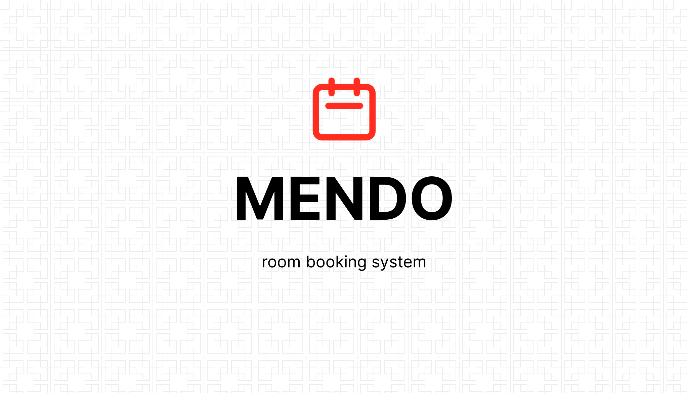

<kbd></kbd>


> '**mendo**' - на языке эсперанто означает '**бронирование**'   

## Система бронирования номеров для гостиниц, отелей, хостелов :watch:

 - язык программирования = Python
 - web-framework = Django
 - БД = PostgreSQL

### Опции системы >>> :gear:

	- административная панель для менеджмента номеров
	- управление номерным фондом 
	- контроль доступности номеров
	- детализация номера
	- типы номеров и установка цен

	- настройка и разграничение прав доступа пользователей системы
	- регистрация, вход и выход пользователей из системы

	- экспорт данных в формат pdf
	- экспорт данных в формат doc
	- экспорт данных в формат xls
	- экспорт данных в формат csv

	- встроенная система фильтров по рубрикам

	- работа с уведомлениями по электронной почте

	- и тп и мн.др.

# django-hms

## Hostel Management System

### Introduction
The aim of the project is to build a hostel management system which allows students to select their rooms online. They can also change rooms and pay fees. It also allows wardens to see the status of rooms and its occupants and fee status. Wardens can also make announcements which can be viewed by the students.


### Models
* Student: For holding student details
* Room: To hold room occupancy
* Approval: To hold room change requests
* NewRegistration: To hold New Room requests
* Fees: To hold fee details
* Posts: To hold notice posts


### Functions
* A Login page for authentication purpose (student or warden)
* Sign Up Verification
* Password reset page
* Allows students to view rooms and select rooms
* Show Student Profile
* Update Student Profile
* Pay fees
* Change allocated room (with warden approval)
* View announcements made by warden
* Allows warden to view room status, its occupancy and the student profile
* Allows warden to create room and manage change room requests
* Allows warden to make annoucements in the notice board
* Email notification for students after room change request has been processed. 
* Allows warden to do fee processing
* Warden can see details of all students and fee history


### Workflow

* Student
	* Landing page presented
	* Option to Sign Up or Login
	* If Logged in 
		* shows user profile and allotted room
		* option to change room
		* option to update profile
		* option to view Notice Board
	* If new user:
		* Has to sign up
		* After sign up redirected to user profile
		* Option to select room is given 
		* Onclick, list of rooms available shown
		* After selection, selected room is given for warden approval, and redirected to user profile
		* Option to pay fees
		* Onclick, a request will be registered (after reading instructions)
		* Email confirmation for both room and fee status.	
		
* Warden
	* Can login from home (sign up is done by admin only)
	* Presented with All Rooms and an option to view inmates
	* Option to add room, which sends to another page to fill in room details
	* Can approve/reject room change requests
	* Can approve/reject fee requests
	* Can view detailed profile of room inmates
	* Can view fee history
	* Can add/delete notices
	* Can view brief profile view of all students


***Разработчик: FrontEnd & BackEnd >>> :hammer_and_pick:***
```team
Александр Бабына. https://github.com/Alba3k
```

***Приветствуются все пожелания и предложения по работе системы >>> :envelope:***


